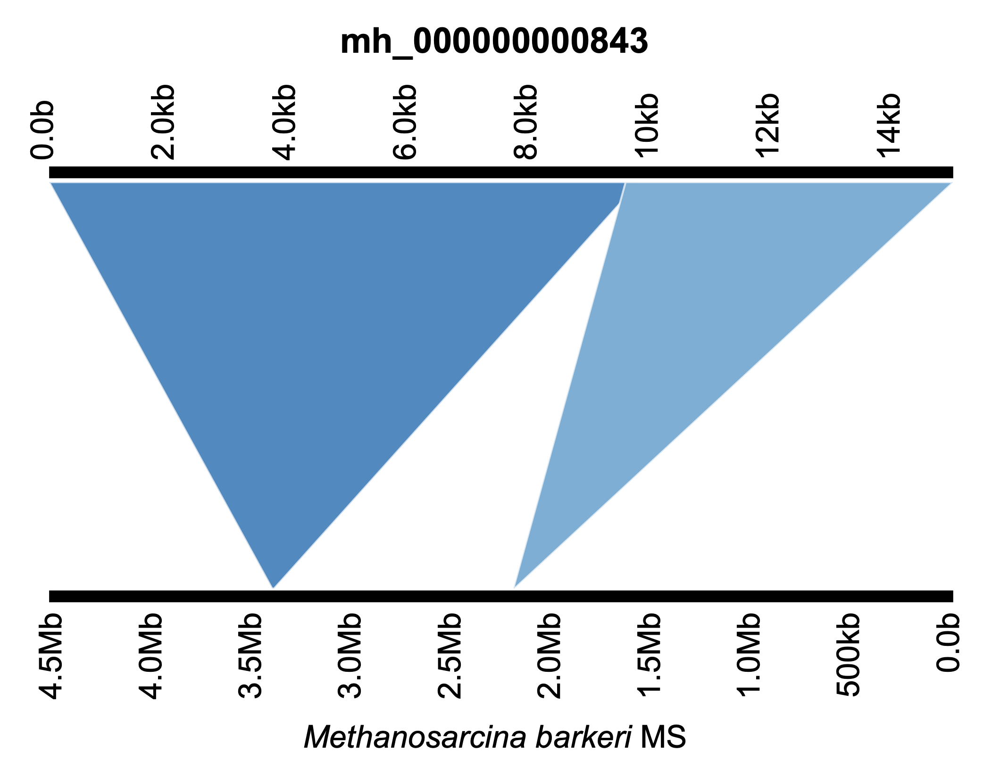

# refineC


[](https://github.com/genomewalker/refine-contigs/releases) [](https://github.com/genomewalker/refine-contigs/actions) [](https://pypi.org/project/refine-contigs/) [](https://anaconda.org/genomewalker/refine-contigs)


refineC is a simple tool to identify potential misassemblies in contigs recovered from ancient metagenomes. The assembly of ancient metagenomics data is challenging due to the short length and post-mortem damage in reads. The short length of the reads pushes the limits of the assemblers, and the recovered contigs might contain misassemblies that can, for example, lead to misleading ecological insights, spurious pangenomic analyses, erroneous prediction of the functional potential or impact the outcome of the binning process by mixing distantly related or unrelated phylogenetic gene markers. With the assembly of ancient metagenomics data we can face different problems:

- **Inter-genomic mosaic**: Chimeric contigs containing a mixture of sequence from multiple organisms
- **Intra-genomic mosaic**: Chimeric contigs mixing different genomic regions from the same organism
- **Temporal mosaic**: Chimeric contigs containing a mixture of sequence from different times (and organisms)


At the moment refineC can mitigate the effects of the first and second type of problems by exploiting the information of de Bruijn (Megahit/Spades) and overlap-based assemblers (PLASS/PenguiN). While the de Bruijn assemblers will assemble longer contigs, the overlap-based assemblers will recover more of the ancient sequence space precent in the ancient sample. In any case, both type of assemblers will end up generating misassembled contigs, especially when we fine-tune the assemblers to recover as much as possible.

RefineC follows a simple approach to identify the misassemblies:

- Perform an all-vs-all contig comparison
- Identify groups of contigs that share a certain amount of sequence identity and coverage
- Find overlapping regions for each contig supported by other contigs and extract the longest one. Keep the leftover parts of the contigs if they are longer than a certain threshold
- Remove redundancy of the overlapping fragments by sequence clustering
- Add the new contig set to the originasl set of contigs without hits in the all-vs-all comparison
- Remove redundancy by sequence clustering


# Installation

We recommend to have [**conda**](https://docs.conda.io/en/latest/) installed to manage the virtual environments

### Using pip

First we create a conda virtual environment with:

```bash
wget https://raw.githubusercontent.com/genomewalker/refine-contigs/master/environment.yml
conda env create -f environment.yml
```

Then we proceed to install using pip:

```bash
pip install refine-contigs
```

### Using conda

```bash
conda install -c conda-forge -c bioconda -c genomewalker refine-contigs
```

### Install from source to use the development version

Using pip

```bash
pip install git+ssh://git@github.com/genomewalker/refine-contigs.git
```

By cloning in a dedicated conda environment

```bash
git clone git@github.com:genomewalker/refine-contigs.git
cd refine-contigs
conda env create -f environment.yml
conda activate refine-contigs
pip install -e .
```


# Usage

refineC only needs a contig file. For a complete list of option

```
$ refineC --help

usage: refineC [-h] --contigs FILE [--tmp DIR] [--threads INT]
              [--prefix PREFIX] [--output OUT] [--min-id FLOAT]
              [--min-cov FLOAT] [--frag-min-len INT] [--frag-cls-id FLOAT]
              [--frag-cls-cov FLOAT] [--glob-cls-id FLOAT]
              [--glob-cls-cov FLOAT] [--debug] [--keep-files] [--version]

Merges overlapping sequences using minimus2

required arguments:
  --contigs FILE        Contig file to merge with minimus2

Overlap identification arguments:
  --min-id FLOAT        Minimun id to use for the overlap (default: 95.0)
  --min-cov FLOAT       Minimun percentage of the coverage for the overlap
                        (default: 0.25)

Fragment refinement arguments:
  --frag-min-len INT    Minimum fragment length to keep (default: 1000)
  --frag-cls-id FLOAT   Minimum identity to cluster the fragments (default:
                        0.95)
  --frag-cls-cov FLOAT  Minimum coverage to cluster the fragments (default:
                        0.6)

Final clustering arguments:
  --glob-cls-id FLOAT   Minimum identity to cluster the refined dataset
                        (default: 0.9)
  --glob-cls-cov FLOAT  Minimum coverage to cluster the refined dataset
                        (default: 0.9)

optional arguments:
  -h, --help            show this help message and exit
  --tmp DIR             Temporary directory (default: ./tmp)
  --threads INT         Number of threads (default: 16)
  --prefix PREFIX       Prefix for contigs name (default: contig)
  --output OUT          Fasta file name to save the merged contigs (default:
                        contigs-merged)
  --debug               Print debug messages (default: False)
  --keep-files          Keep temporary data (default: True)
  --version             Print program version
```


One would run refineC as:

```bash
refineC --contigs b40d22c9e7.assm.combined.fasta --min-id 95.0 --min-cov 0.6 --prefix ctg --output contigs-merged --threads 32
```

*--contigs*: Here we specify the location of the contigs to merge

*--min-id*: Minimum identitify for the overlaps between contig pairs

*--min-cov*: Minimum coverage between contig pairs

*--prefix*: Prefix for the contig name

*--output*: Name for the output file

*--threads*: Number of threads


# Misassemblies in acient metagenomic data

As a proof of concept we generated synthetic ancient data with [aMGSIM](https://github.com/genomewalker/aMGSIM) from _Methanosarcina bakeri_ MS (4,533,209 nt). In total we generated 625,270 PE reads (20X) with a modal read length of 63nt and the following parameters for the Briggs model [0.03, 0.1, 0.01, 0.2]. We performed three different assemblies:

- Megahit with default parameters
- Megahit with fine-tuned parameters
- Experimental assembly worflow for ancient metagenomic data (Will be public soon)

The statistics of the **Megahit with default parameters** for the contigs longer than 1000nt are:

- Number of contigs: 1,339
- Assembly length: 3,855,942
- Average contig length: 2,879
- Maximum contig length: 16,423

The following table shows the anvi'o estimates for this assembly:

```
╒════════════╤══════════╤══════════════╤════════════════╤════════════════╤══════════════╤════════════════╕
│ bin name   │ domain   │   confidence │   % completion │   % redundancy │   num_splits │   total length │
╞════════════╪══════════╪══════════════╪════════════════╪════════════════╪══════════════╪════════════════╡
│ bin1       │ ARCHAEA  │          0.8 │          90.79 │           6.58 │         1339 │        3855942 │
╘════════════╧══════════╧══════════════╧════════════════╧════════════════╧══════════════╧════════════════╛

```

As you can see, this would be a _medium-quality_ recovered MAG. The statistics are not so bad, and we recover ~85% of the size of the genome. But when we look in detail, we find misassembled contigs that contain fragments from distant regions of the genome:


This is not exlcusive of Megahit, with SPAdes we have similar situations. Here the missambly cover different regions and different strand:


If we push the limits from Megahit and we fine-tune some of its options, we can get an assembly with better statistics:

- Number of contigs: 934
- Assembly length: 4,206,221
- Average contig length: 4,503
- Maximum contig length: 26,014


 with same values of redundancy but larger completion and we recover a larger potential fraction of the genome (~92%):

```
╒════════════╤══════════╤══════════════╤════════════════╤════════════════╤══════════════╤════════════════╕
│ bin name   │ domain   │   confidence │   % completion │   % redundancy │   num_splits │   total length │
╞════════════╪══════════╪══════════════╪════════════════╪════════════════╪══════════════╪════════════════╡
│ bin1       │ ARCHAEA  │          0.9 │          94.74 │           6.58 │          934 │        4206221 │
╘════════════╧══════════╧══════════════╧════════════════╧════════════════╧══════════════╧════════════════╛
```

But of course this also translates in potentially having more misassemblies. As an example:
<p align="center">

<p />

Finally, as an example of using an assembly workflow specially designed for ancient metagenomics data that combines de Bruijn and overlap-based methods in combination with refineC, we obtain an assembly like:

- Number of contigs: 1,175
- Assembly length: 4,419,745
- Average contig length: 3,761
- Maximum contig length: 17,453


In this case the estimates from anvi'o show a lower redundancy values, with the same completion and it potentially recovered 97% of the genome length
```
╒════════════╤══════════╤══════════════╤════════════════╤════════════════╤══════════════╤════════════════╕
│ bin name   │ domain   │   confidence │   % completion │   % redundancy │   num_splits │   total length │
╞════════════╪══════════╪══════════════╪════════════════╪════════════════╪══════════════╪════════════════╡
│ bin1       │ ARCHAEA  │          0.9 │          94.74 │           3.95 │         1175 │        4419745 │
╘════════════╧══════════╧══════════════╧════════════════╧════════════════╧══════════════╧════════════════╛
```

In this case, we follow a conservative approach to minimize the risk of misassemblies. This translates in a slighlty smaller contig average size as refineC will fragment the contigs not well supported. For example, taking the contig `mh_000000000843` shown before to be misassembled in the **Megahit with fine-tuned parameters** assembly, the contig should be split in two parts, from 1-9757 and from 9536-14953. As refineC is a reference free method, it uses the available information within the de Bruijn and overlap-based assemblies and produces the following splits:

|           Contig           | Start |  End  |    Class    | Length |
|:--------------------------:|:-----:|:-----:|:-----------:|:------:|
| 98f2aa9f20_mh_000000000843 |   1   |  2179 |   overlap   |  2178  |
| 98f2aa9f20_mh_000000000843 |  5010 |  9757 |   overlap   |  4747  |
| 98f2aa9f20_mh_000000000843 |  2179 |  5010 | non-overlap |  2831  |
| 98f2aa9f20_mh_000000000843 |  9757 | 14953 | non-overlap |  5196  |

RefineC breaks the contig `98f2aa9f20_mh_000000000843` in four fragments, two of them are supported by other contigs and two of them are unique to this contig. Increasing the fragmentation is a small price to pay to have higher quality contigs.